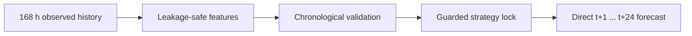

<div align="center">

# TRACE & TCFN for Photovoltaic Power Forecasting

**Leakage-resistant, interpretable, and reproducible forecasting for hourly solar-PV trajectories**

[](https://www.python.org/)
[](https://jupyter.org/)
[](https://github.com/johnnyone89/TCFN4PVForecasting/actions/workflows/notebook-quality.yml)
[](https://doi.org/10.23023/JPT.2026.14.1.003)

[Overview](#overview) · [Results](#revised-trace-results) · [Notebooks](#notebooks) · [Run](#quick-start) · [Reproducibility](docs/REPRODUCIBILITY.md) · [Citation](#citation)

</div>

---

## Overview

This repository contains the official research implementation for two complementary photovoltaic (PV) forecasting frameworks:

- **TCFN — Trend–Context Fusion Network:** a hybrid 1D-CNN, multi-head-attention, and LSTM architecture for PV forecasting with SHAP-based interpretation.
- **TRACE — Temporal Regime-Aware Chronological Ensemble:** a guarded, site-adaptive framework that maps the latest 168 observed hours directly to a rolling 24-hour forecast while enforcing the information boundary at each forecast origin.

In TRACE, **chronological** means that every measured predictor is available no later than the forecast origin. It does **not** mean causal-effect identification.



## Why TRACE

TRACE is designed around the operational realities of plant-level PV forecasting:

- structural nighttime zeros are learned from the training period only;
- all zero-valued targets remain in the primary evaluation;
- feature memory and zero-handling strategy are selected on validation data only;
- a Pareto guard chooses between **hurdle** and **direct-all** prediction;
- final models are refitted on training plus validation data before a single held-out test evaluation;
- uncertainty and paired comparisons respect dependence among overlapping forecast trajectories;
- global, horizon-specific, and local explainability analyses are included.

## Revised TRACE results

The revised manuscript reports the following all-hours held-out results over **245,400 origin–horizon pairs per site**:

| Site | Selected strategy | RMSE (kW) | MAE (kW) | R² | Interpretation |
|---|---|---:|---:|---:|---|
| Dangjin | Short-memory direct-all | 100.91 | 50.67 | 0.828 | Lowest RMSE; practically tied with 1D-CNN–BiLSTM and not uniformly superior by MAE |
| Gwangyang | Short-memory hurdle | 167.39 | 83.45 | 0.824 | Clearer advantage across the reported aggregate metrics |

Relative to the retrained direct 24-output TCFN benchmark, TRACE reduced RMSE by **7.94%** at Dangjin and **7.57%** at Gwangyang. These results should be read with the manuscript's site- and loss-specific statistical qualifications; they do not imply uniform superiority across every metric or setting.

## Notebooks

| Notebook | Role | Main output |
|---|---|---|
| [`TRACE_Guarded_Dual_Strategy_PV_Forecasting.ipynb`](code/TRACE_Guarded_Dual_Strategy_PV_Forecasting.ipynb) | Complete TRACE pipeline | Data audit, chronological selection, refit, benchmarks, inference bundles, uncertainty, statistical tests, ablations, and XAI |
| [`TRACE_Reviewer_Revision_AllInOne.ipynb`](code/TRACE_Reviewer_Revision_AllInOne.ipynb) | Reviewer-revision companion | Restricted-scope fairness checks, model-capacity tables, figure re-exports, and RMSE/MAE selection-weight sensitivity |
| [`main_tcfn_pipeline.ipynb`](code/main_tcfn_pipeline.ipynb) | Main TCFN experiment | Training, evaluation, and SHAP interpretation |
| [`benchmark_comparison.ipynb`](code/benchmark_comparison.ipynb) | TCFN benchmark study | Controlled comparison with representative sequence models |
| [`ablation_study_variants.ipynb`](code/ablation_study_variants.ipynb) | TCFN ablation study | Component-level architecture analysis |

## Repository layout

```text
TCFN4PVForecasting/
├── code/
│   ├── TRACE_Guarded_Dual_Strategy_PV_Forecasting.ipynb
│   ├── TRACE_Reviewer_Revision_AllInOne.ipynb
│   ├── main_tcfn_pipeline.ipynb
│   ├── benchmark_comparison.ipynb
│   └── ablation_study_variants.ipynb
├── data/
│   ├── README.md
│   ├── Dangjin_Landfill_PV_Dataset.csv
│   └── Gwangyang_Port_Site2_PV_Dataset.csv
├── docs/
│   └── REPRODUCIBILITY.md
├── scripts/
│   └── check_notebooks.py
├── .github/workflows/notebook-quality.yml
├── CITATION.cff
├── requirements.txt
└── requirements-tcfn.txt
```

## Quick start

### 1. Clone and create an environment

```bash
git clone https://github.com/johnnyone89/TCFN4PVForecasting.git
cd TCFN4PVForecasting

python -m venv .venv
source .venv/bin/activate  # Windows: .venv\Scripts\activate
python -m pip install --upgrade pip
pip install -r requirements.txt
```

The recorded TRACE experiment used Python 3.9.25, pandas 2.3.3, NumPy 2.0.2, scikit-learn 1.6.1, and PyTorch 2.8.0. Matching scikit-learn 1.6.1 is especially important when loading archived joblib bundles.

For the original TensorFlow-based TCFN notebooks, install the optional environment extension with `pip install -r requirements-tcfn.txt`.

### 2. Supply the datasets

Place the two study CSV files in `data/` using these exact names:

```text
data/Dangjin_Landfill_PV_Dataset.csv
data/Gwangyang_Port_Site2_PV_Dataset.csv
```

The current public CSV entries are filename placeholders rather than the study observations. See [`data/README.md`](data/README.md) for the required schema and integrity checks. You may alternatively set `TRACE_DATA_DIR` to a directory containing the files.

### 3. Run the main TRACE pipeline

```bash
jupyter lab code/TRACE_Guarded_Dual_Strategy_PV_Forecasting.ipynb
```

Run all cells in order. Outputs are written to `TRACE_outputs/` and are excluded from version control.

For a short structural check, set `TRACE_FAST=1`. To inspect preprocessing and tree models without the deep-learning benchmarks, set `TRACE_SKIP_DEEP=1`.

### 4. Run the reviewer-revision companion

The companion notebook requires the archived original output bundle:

```text
input/TRACE_PV24_outputs.zip
```

The archive is intentionally not committed because it contains large predictions, checkpoints, and serialized model bundles. A local manuscript copy at `input/TRACE_submission_manuscript.docx` is optional and is used only for provenance hashing.

```bash
jupyter lab code/TRACE_Reviewer_Revision_AllInOne.ipynb
```

Generated revision materials are written to `outputs/`. Set `TRACE_RUN_SENSITIVITY=0` or `TRACE_RUN_SHAP=0` to skip the corresponding optional rerun or re-export.

## Evaluation design

| Component | Protocol |
|---|---|
| Forecast task | Hourly rolling direct forecast from t+1 through t+24 |
| Observed history | 168 consecutive hours |
| Split | 28 training months / 14 validation months / 14 test months |
| Primary scope | All origin–horizon pairs, including observed zeros |
| Selection | Validation-only feature profile, expert weights, threshold, and strategy |
| Final fitting | Training + validation, with decisions already locked |
| Uncertainty | 1,000-replicate date-block bootstrap |
| Paired testing | Daily loss differences with dependence-aware inference and Holm correction |

Full artifact requirements, data columns, run modes, and validation commands are documented in [`docs/REPRODUCIBILITY.md`](docs/REPRODUCIBILITY.md).

## Citation

For the published TCFN study, please cite:

> Shin, Y.; Moon, J. **Trend–Context Fusion Network with Multi-Head Attention for Solar Photovoltaic Power Forecasting.** *Journal of Platform Technology* **2026**, *14*(1), 3–21. https://doi.org/10.23023/JPT.2026.14.1.003

Citation information for TRACE will be added after publication. GitHub's **Cite this repository** control is enabled through [`CITATION.cff`](CITATION.cff).

## Contact

**Jihoon Moon, Ph.D.**<br>
Assistant Professor, Department of Data Science<br>
Duksung Women's University, Seoul 01369, Republic of Korea<br>
[jmoon25@duksung.ac.kr](mailto:jmoon25@duksung.ac.kr)

---

<div align="center">
Built for transparent, auditable, and reproducible PV forecasting research.
</div>
